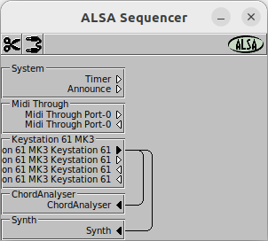

# Midi Chord Analyser

## Features

Common chords are displayed with their root note, quality and scale degree.

When running the app appears as a midi input device called ChordAnalyser

### Root note: 

eg C,C♯,E,E♭ ...

### Quality: 

eg Major, m Minor, ⁺ Augmented, ° Diminished, ⁷ Seventh ...

### Scale Degree in Roman Numerals 

eg Major: I ii  iii IV V vi vii°

eg minor: i ii° III iv v VI VII 

### Example Chord

eg: Chord:  B♭   Major VI

The key signature is displayed when no chords are playing.

eg: 1♭ Key:  Dm    minor

### Key Signature

Set the Key Signature by playing far right hand notes A♯BC together followed by the new scale chord

Ref: https://en.wikipedia.org/wiki/Chord_notation

The app uses Linux ALSA, Jack compatibility may be added later.

## Building
To compile the app under linux download all the files and compile using make. 
eg *$ make*

## Using

Start a sound synthesizer 

eg: *$ fluidsynth -p Synth /usr/share/sounds/sf2/FluidR3_GM.sf2*

### Start the app

eg: *$ ./ChordAnalyser*

### Connecting outputs to inputs

Then run aconnect to connect a midi keyboard output to the chord analyser input and synth input

eg: *$ aconnect -l # discover the identity of midi devices available*

### Auto connect and view
eg: *$ aconnect 28 128 ; aconnect 28 129 ; aconnectgui*

NB aconnectgui has the title ALSA Sequencer

## Errors, omissions and improvements

Please contact the author

