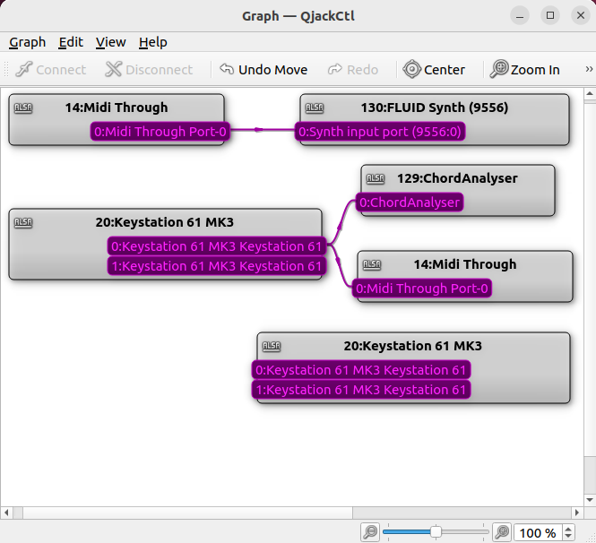

# Midi Chord Analyser

## Features

Common block chords are displayed with their root note, quality and scale degree.

When running the app appears as a midi input device called ChordAnalyser

The app uses Linux ALSA. Jack compatibility may be added later.

### Root note: 

eg C,C♯,E,E♭ ...

### Quality: 

eg Major, m Minor, ⁺ Augmented, ° Diminished, ⁷ Seventh ...

### Scale Degree in Roman Numerals 

eg Major: I ii  iii IV V vi vii°

eg minor: i ii° III iv v VI VII 

### Example Key signature and chord display
~~~
Key    Key   Scale
Sig    Name  Degree   Chord
1♭     Dm    i        Dm
1♭     Dm    ii°      E°
1♭     Dm    III      F
1♭     Dm             G
1♭     Dm    iv       Gm
1♭     Dm    v        Am
1♭     Dm    VI       B♭
1♭     Dm    VII      C
~~~
### Setting the Key Signature

Set the Key Signature by playing far right hand notes A♯BC together followed by the new scale chord.

Example Key Signature Prompt:
~~~
           Chord Analyser

KSig  Major RelMinor  Diatonic Scale
7♭      C♭      A♭    C♭ D♭ E♭ F♭ G♭ A♭ B♭
6♭      G♭      E♭    G♭ A♭ B♭ C♭ D♭ E♭ F
5♭      D♭      B♭    D♭ E♭ F  G♭ A♭ B♭ C
4♭      A♭      F     A♭ B♭ C  D♭ E♭ F  G
3♭      E♭      C     E♭ F  G  A♭ B♭ C  D
2♭      B♭      G     B♭ C  D  E♭ F  G  A
1♭      F       D     F  G  A  B♭ C  D  E
        C       A     C  D  E  F  G  A  B  
1♯      G       E     G  A  B  C  D  E  F♯ 
2♯      D       B     D  E  F♯ G  A  B  C♯ 
3♯      A       F♯    A  B  C♯ D  E  F♯ G♯ 
4♯      E       C♯    E  F♯ G♯ A  B  C♯ D♯ 
5♯      B       G♯    B  C♯ D♯ E  F♯ G♯ A♯ 
6♯      F♯      D♯    F♯ G♯ A♯ B  C♯ D♯ E♯ 
7♯      C♯      A♯    C♯ D♯ E♯ F♯ G♯ A♯ B♯ 

To set the key signature play the major or minor chord of the same name.
Play the root note above♯ or below♭ middle C to select keys with 5-7♯ or 5-7♭
~~~

eg: To set Dminor key. On the midi keyboard play top A♯+B+C followed by D+F+A

Ref: https://en.wikipedia.org/wiki/Chord_notation

## Building
To compile the app under linux download all the files and compile using make.
~~~
 $ make # or edit and run the build script to suit
~~~

## Using
### View the midi devices 
~~~
 $ qjackctl & # press the graph button
~~~

### Start a synthesizer
~~~
qsynth &
~~~
### Start the app

~~~
./ChordAnalyser  -i 20:0 # connect to keyboard.
~~~

 The keyboard device number may change.

 Connect & disconnect the midi connections in qjackctl if needed

 ### View midi events
 ~~~
 midisnoop &
 ~~~

 If things are not working as expected, visibility is the key

## Errors, omissions and improvements

Please contact the author

Built and tested on Ubuntu Linux 22.04 X86 & ARM versions

