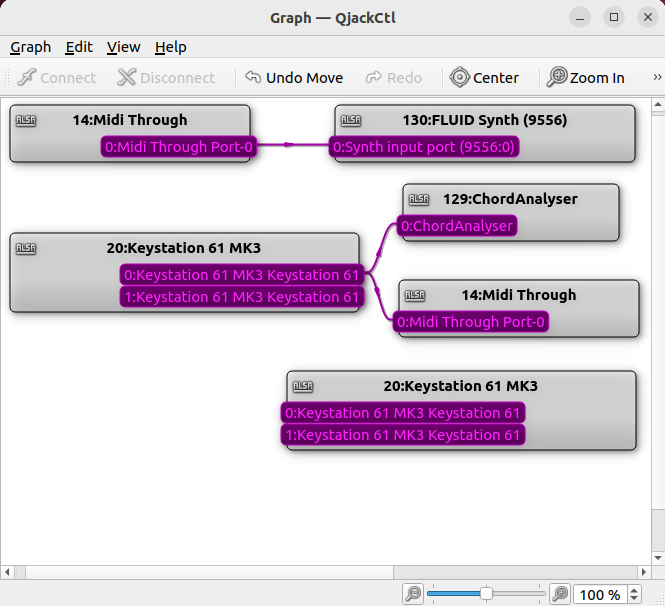

# Midi Chord Analyser

## Features

Common block chords are displayed with their root note, quality and scale degree.

When running the app appears as a midi input device called ChordAnalyser

The app uses Linux ALSA. Jack compatibility may be added later.

### Root note: 

eg C,C♯,E,E♭ ...

### Quality: 

eg Major, m Minor, ⁺ Augmented, ° Diminished, ⁷ Seventh ...

### Scale Degree in Roman Numerals 

eg Major chords : I II III IV VI VII

eg minor chords : i ii iii iv vi vii

### Example Key signature and chord display
~~~
Key    Key   Scale
Sig    Name  Degree   Chord
1♭     Dm    i        Dm
1♭     Dm    ii       E°
1♭     Dm    III      F
1♭     Dm    IV       G
1♭     Dm    iv       Gm
1♭     Dm    v        Am
1♭     Dm    VI       B♭
1♭     Dm    VII      C
~~~
### Setting the Key Signature

Set the Key Signature by playing far right hand notes A♯BC together followed by the new scale chord of the same name.
Example Key Signature Prompt:
~~~
           Chord Analyser

KSig  Major RelMinor  Diatonic Scale
7♭      C♭      A♭    C♭ D♭ E♭ F♭ G♭ A♭ B♭
6♭      G♭      E♭    G♭ A♭ B♭ C♭ D♭ E♭ F
5♭      D♭      B♭    D♭ E♭ F  G♭ A♭ B♭ C
4♭      A♭      F     A♭ B♭ C  D♭ E♭ F  G
3♭      E♭      C     E♭ F  G  A♭ B♭ C  D
2♭      B♭      G     B♭ C  D  E♭ F  G  A
1♭      F       D     F  G  A  B♭ C  D  E
        C       A     C  D  E  F  G  A  B  
1♯      G       E     G  A  B  C  D  E  F♯ 
2♯      D       B     D  E  F♯ G  A  B  C♯ 
3♯      A       F♯    A  B  C♯ D  E  F♯ G♯ 
4♯      E       C♯    E  F♯ G♯ A  B  C♯ D♯ 
5♯      B       G♯    B  C♯ D♯ E  F♯ G♯ A♯ 
6♯      F♯      D♯    F♯ G♯ A♯ B  C♯ D♯ E♯ 
7♯      C♯      A♯    C♯ D♯ E♯ F♯ G♯ A♯ B♯ 

To set the key signature play the major or minor chord of the same name.
Play the root note above♯ or below♭ middle C to select keys with 5-7♯ or 5-7♭
~~~

eg: To set Dminor key. On the midi keyboard play A♯+B+C followed by D+F+A

Ref: https://en.wikipedia.org/wiki/Chord_notation

### Piano Pedal Controls
~~~
* Soft      Pedal - New Key Signature (Left) 
* Sostenuto Pedal - Chord List        (Centre)
* Sustain   Pedal - Arpegio Mode      (Right)
~~~
### Support Chord List
The supported chord list may be seen on the terminal screen using the -l command, by pressing the Sostenuto pedal, or by pressing G#+B+C keys.
~~~
Supported Chord List ( C  shown as root note )        1 * 2 * 3 4 * 5 * 6 * 7th
C Major,    ,  M  , maj  , Maj  , ma  , Δ      Notes: C       E     G          
C Major  7th,  M7 , maj7 , Maj7 , ma7 , Δ⁷     Notes: C       E     G       B  Optional: 5th 
C Major  9th,  M9 , maj9 , Maj9 , ma9 , Δ9     Notes: C   D   E     G       B  Optional: 5th 
C Major 11th,  M11, maj11, Maj11, ma11, Δ11    Notes: C   D   E F   G       B  Optional: 9th 5th 
C Major 13th,  M13, maj13, Maj13, ma13, Δ13    Notes: C   D   E F   G   A   B  Optional: 9th 11th 5th 
C Major  6th,  M6 , maj6 , Maj6 , ma6 , Δ6     Notes: C       E     G   A      Optional: 5th 
C Major  6/9, M6/9,maj6/9,Maj6/9,ma8/9, Δ6/9   Notes: C   D   E     G   A      Optional: 5th 
C Major 7♯11,M7♯11,  Maj7♯11 , maj7♯11, Δ7♯11  Notes: C   D   E   F♯G       B  Optional: 9th 5th 
C minor     ,   - , min  ,  mi                 Notes: C     E♭      G          
C minor  7th,  m7 , min7 ,  mi7 , −7           Notes: C     E♭      G     B♭   Optional: 5th 
C minor  9th,  m9 , min9 ,  mi9 , −9           Notes: C   D E♭      G     B♭   Optional: 5th 
C minor 11th,  m11, min11,  mi11, −11          Notes: C   D E♭  F   G     B♭   Optional: 9th 5th 
C minor 13th,  m13, min13,  mi13, −13          Notes: C   D E♭  F   G   A B♭   Optional: 9th 11th 5th 
C minor  6th,  m6 , min6 ,  mi6 , −6           Notes: C     E♭      G   A      Optional: 5th 
C minor Flat 6th ,Flat6th, min♭6,mi♭6,m♭6,−♭6  Notes: C     E♭      G A♭       Optional: 5th 
C minor 6th/9th,Min6/9,min6/9,mi6/9,m6/9,−6/9  Notes: C   D E♭      G   A      Optional: 5th 
C Minor/Major 7th,minMaj7,mM7,m/M7,mi/Ma7,-Δ7  Notes: C     E♭      G       B  Optional: 5th 
C 7, Dominant  7th, dom⁷                       Notes: C       E     G     B♭   Optional: 5th 
C 9, Dominant  9th, dom9                       Notes: C   D   E     G     B♭   Optional: 5th 
C 11,Dominant 11th, dom11                      Notes: C   D   E F   G     B♭   Optional: 9th 5th 
C 13,Dominant 13th, dom13                      Notes: C   D   E F   G   A B♭   Optional: 9th 11th 5th 
C Dominant 7th Flat 5, 7♭5                     Notes: C       E   G♭      B♭   
C Dominant 7♯9, 7♯9                            Notes: C     D♯E     G     B♭   Optional: 5th 
C Dominant 7♭9, 7♭9                            Notes: C D♭    E     G     B♭   Optional: 5th 
C Dominant 7♯11, 7♯11                          Notes: C   D   E   F♯G     B♭   Optional: 9th 5th 
C Suspended Fourth, sus4, sus                  Notes: C         F   G          
C Dominant 7th Suspended 4th, 7sus4            Notes: C         F   G     B♭   Optional: 5th 
C Dominant 9th Suspended 4th, 9sus4            Notes: C   D     F   G     B♭   Optional: 5th 
C Suspended 2nd,  sus2                         Notes: C   D         G          
C Dominant 7th Suspended 2nd, 7sus2            Notes: C   D         G     B♭   Optional: 5th 
C Diminished, dim, °                           Notes: C     E♭    G♭           
C Diminished 7th, dim7, °7                     Notes: C     E♭    G♭    A      
C Half Diminished 7th, minor 7 flat 5, -7♭5    Notes: C     E♭    G♭      B♭   
C Augmented, aug, +                            Notes: C       E       G♯       
C Augmented 7th, aug7, +7, 7♯5                 Notes: C       E       G♯  B♭   
C Augmented Major 7th, augM7, +M7, M7♯5        Notes: C       E       G♯    B  
~~~

### Example Chord Display

e.g. Playing the notes C + E + G♭ + B♭
Displays four different chord spellings. 
~~~
Key    Key   Scale
Sig    Name  Degree   Chord                                                     1 * 2 * 3 4 * 5 * 6 * 7th

0♭     C        I     C Dominant 7th Flat 5, 7♭5                         Notes: C       E   G♭      B♭
0♭     C        I     C Dominant 7♯11, 7♯11                              Notes: C   D   E   F♯G     B♭   Optional: 9th 5th
0♭     C              G♭Dominant 7th Flat 5, 7♭5                   /C    Notes: C       E   G♭      B♭
0♭     C              G♭Dominant 7♯11, 7♯11                        /C    Notes: C D♭    E   F♯  A♭  B♭   Optional: 9th 5th

~~~
Optional notes are displayed underscored when played or in inverse video when not played.

## Building
To compile the app under linux download all the files and compile using make.
~~~
 $ make # or edit and run the build script to suit
~~~

## Using
### View the midi devices 
~~~
 $ qjackctl & # press the graph button
~~~

### Start a synthesizer
~~~
qsynth &
~~~
### Start the app

~~~
./ChordAnalyser  -i 20:0 # connect to keyboard.
~~~

 The keyboard device number may change.

 Connect & disconnect the midi connections in qjackctl if needed

### View midi events
 ~~~
 midisnoop &
 ~~~

 If things are not working as expected, visibility is the key

## Errors, omissions and improvements

Please contact the author

Built and tested on Ubuntu Linux 22.04 X86 & ARM versions with 88 key piano 

